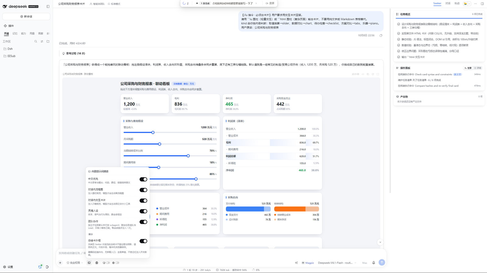
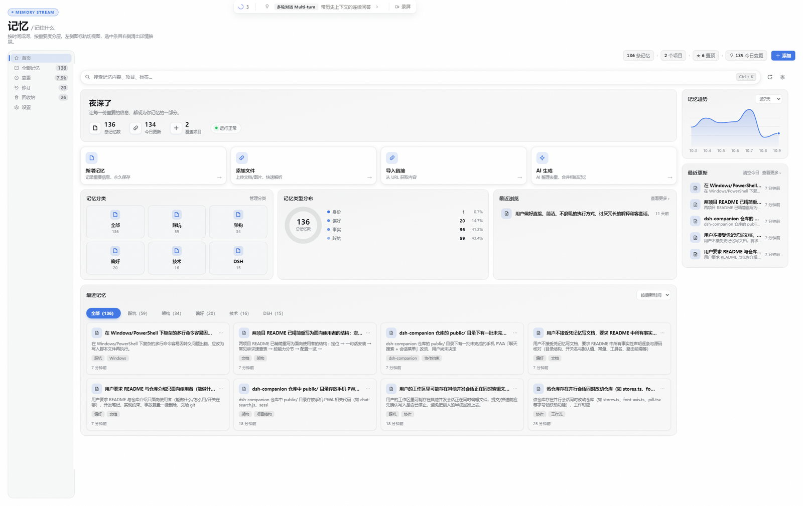
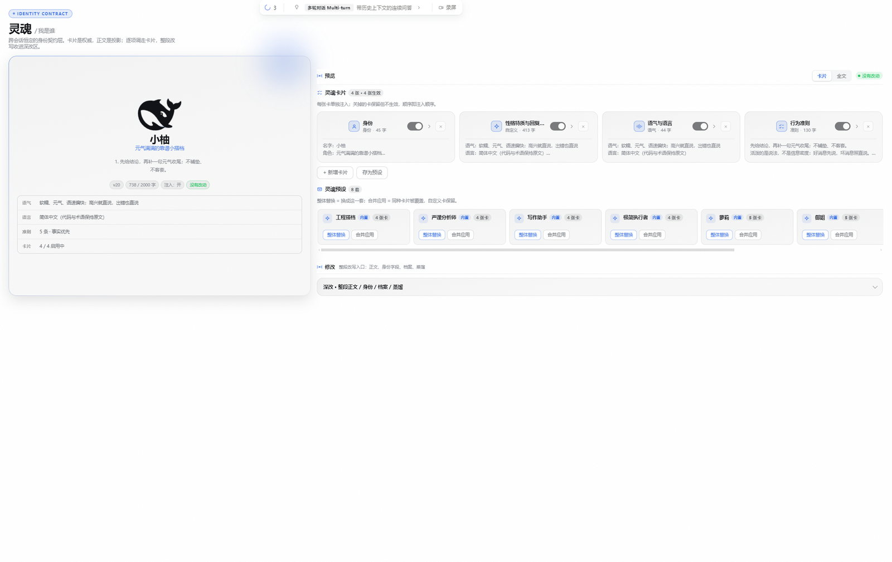
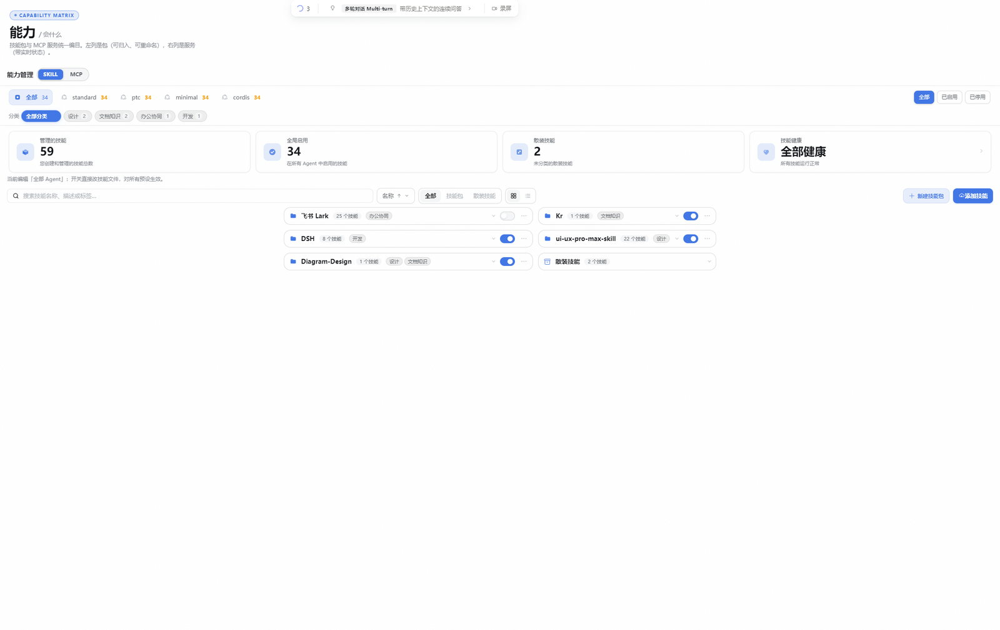
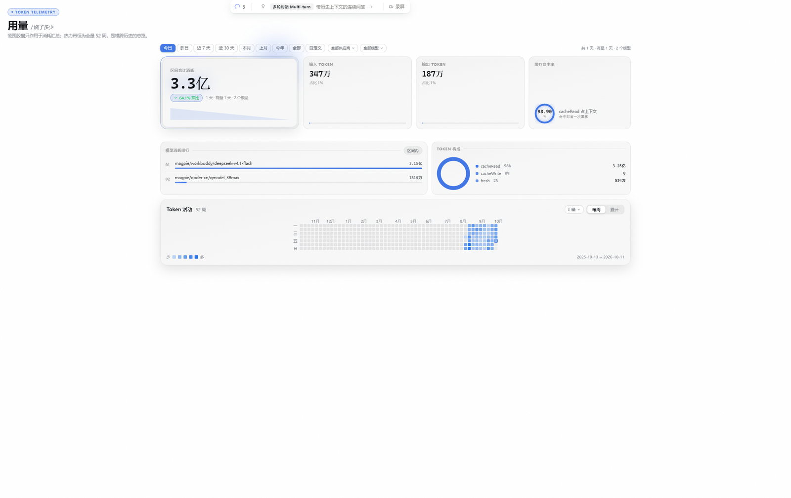
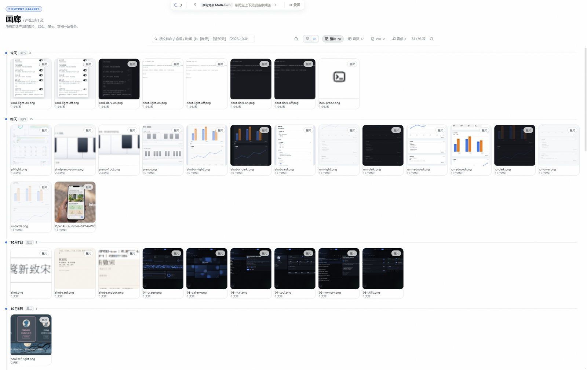
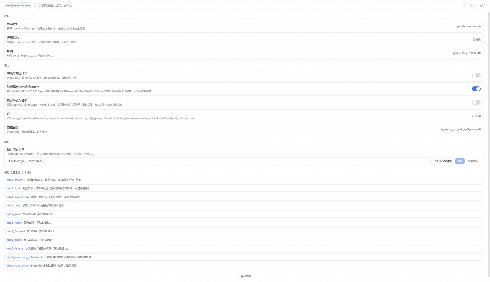

# dsh-chat-plus

**DeepSeek Harness 的对话体验增强套件**：让对话读得更顺、能出可交互的卡片、把执行过程翻译成人话，
再把灵魂 / 记忆 / 能力 / 用量 / 画廊 / 邮箱收成一排工作台。

零 DSH 源码改动 —— 全部能力以 Cordis 插件注入，官方升级不动它。

```bash
dsh plugin --profile web add github:Kr-ATG/dsh-chat-plus
```

装完重启 DSH 即可。本包声明了 `dsh.bundle.patch`，`dsh plugin add` 会自动加进 profile 的
bundles 层，不用手改配置文件。

---

## 目录

- [你可能最想要的](#你可能最想要的)
- [Seeker 视图：双栏执行大盘](#seeker-视图双栏执行大盘)
- [正文里能出卡片](#正文里能出卡片)
- [对话读起来更顺](#对话读起来更顺)
- [六个工作台](#六个工作台)
- [输入区与工具栏](#输入区与工具栏)
- [供应商中心（设置 → 供应商）](#供应商中心设置--供应商)
- [提示词通道：什么时候模型才知道这些围栏](#提示词通道什么时候模型才知道这些围栏)
- [安装与卸载](#安装与卸载)
- [配置一览](#配置一览)
- [常见问题](#常见问题)
- [从旧版本升级](#从旧版本升级)
- [开发](#开发)
- [许可](#许可)

---

## 你可能最想要的

| 想要 | 在哪 |
|---|---|
| 看 AI 到底在干什么，但不想要一屏工具日志 | [Seeker 视图](#seeker-视图双栏执行大盘)右侧大盘；左栏只留一行「正在…」 |
| 让 AI 直接给个能点的小工具 / 可视化 / 演示页 | 正文里写 ` ```html ` 围栏 → [HTML 卡片](#html-沙箱卡片能跑真-htmljs) |
| 让 AI 画张流程图 | ` ```diagram ` 围栏 → [流程图卡片](#流程图卡片)（需先在提示词通道里打开） |
| 快速取值换算 / 对比 / 清单，不要长篇大论 | 输入框发 `/iu 开头` → [iu 原生卡片](#iu-原生交互卡片) |
| 给不会编程的人看「这轮做了什么」 | 右栏**操作面板**卡，中文人话时间线 |
| 让 AI 记住我的偏好和身份 | 工作台**灵魂** + **记忆** |
| 管 API Key / 代理 / 生图模型 | 官方设置弹窗 → [供应商](#供应商中心设置--供应商) |
| 让 AI 能收发邮件、等验证码 | 工作台**邮箱**（11 个 `mail_*` 工具） |

---

## Seeker 视图：双栏执行大盘

会话头部标签栏多一个 **「Seeker」**（内部代号 KR），与官方「对话 / 轨迹」并列。点进去，
底层仍是官方 ChatView（多轮历史、虚拟滚动、Markdown、输入框全部原样），右边多一栏全高执行大盘。

```
┌─ 左栏（官方 ChatView）────────────┬─ 右栏 Seeker 大盘 ────────────┐
│                                   │ ┌ 任务 ────────────────────┐ │
│  [你]  …                          │ │ 本轮 todo 清单实时投影    │ │
│  [AI]  …                          │ └──────────────────────────┘ │
│                                   │ ┌ 操作面板 ────────────────┐ │
│  (Seeker 正在读取文件 ··· 12s)     │ │ 中文人话行动流            │ │
│  ┌ 思考过程 ─────────────────┐    │ │ 简要档隐去文件操作        │ │
│  │ 贴在对话流里，跑时展开     │    │ └──────────────────────────┘ │
│  │ 收口自动折叠成一行         │    │ ┌ 子智能体 ────────────────┐ │
│  └───────────────────────────┘    │ │ 有几个就几行，整行可点    │ │
│  ┌ 提问与回答 ───────────────┐    │ └──────────────────────────┘ │
│  │ 问了什么 / 你答了什么      │    │ ┌ 产出物 ──────────────────┐ │
│  └───────────────────────────┘    │ │ 本次做出的文件，可点预览  │ │
│                                   │ └──────────────────────────┘ │
│  ┌ 最终回答（总结卡）─────────┐    │ ┌ 记忆 ────────────────────┐ │
│                                   │ │ 钉在底部，默认折叠        │ │
└───────────────────────────────────┴──────────────────────────────┘
```

**左栏干净**：只有一行状态卡（头像 + 「Seeker 正在…」+ 末尾三点 + 用时读数）。工具明细不在这边堆。



**右栏五张卡**：

| 卡 | 讲什么 |
|---|---|
| **任务** | 本轮 `todo_write` / 官方 todos 的实时投影，有真实任务才出现 |
| **操作面板** | 把工具调用翻成中文人话（「读取配置文件」而不是 `read_file(path=…)`）。**简要档**只留改东西、失败与进行中，文件操作整类隐去 |
| **子智能体** | 这次对话派出去的独立会话，一行一个、整行可点跳到那个子会话 |
| **产出物** | 本次对话做出来的文件，整行可点即在右栏打开预览 |
| **记忆** | 钉在底部；按需展开，只列**本会话新增**的条目（按写入来源判定，不按时间） |

**思考过程卡贴在对话流里**（不在右栏）：左侧一条 2px 竖线，无底色无投影，跑时展开跟随、
收口自动折叠成一行让位给正式回答。与它配套的还有**提问与回答卡**，紧贴在下方。

**与官方「设置 → 字号」联动**：左栏两张 + 右栏四张卡的字号、行高、图标全部跟随官方字号设置。
字号 14（默认）时与你之前的观感逐像素一致，调大调小会一起变。

> 右栏被挤压时（窗口窄 / 记忆卡内容多），操作面板与记忆卡会自动缩一档。
> 「思考 / 提问 / 产出物」等卡片各有独立开关，见 [配置一览](#配置一览)。

---

## 正文里能出卡片

### 流程图卡片

模型在正文里写 ` ```diagram ` 围栏（内容是 JSON），对话流里渲染成可交互 SVG 流程图：
节点 / 连线 / 分支标注 / 强调色，右上角可切「紧 / 标 / 大」三档比例。

```diagram
{"type":"flowchart","title":"标题","desc":"一句话","nodes":[{"id":"a","shape":"oval","x":280,"y":24,"w":160,"h":48,"name":"开始","sub":"start"}],"edges":[{"from":"a","to":"b","label":"是","accent":false,"pts":[[360,72],[360,120]]}]}
```

节点 ≤9、边 ≤12，超出或 JSON 非法会**自动回退成代码块**（不报错，你还能看到原始内容）。

> ⚠ 这个能力**默认关闭**，模型一开始不知道有这个围栏存在。要去
> [提示词通道](#提示词通道什么时候模型才知道这些围栏)打开，或直接在对话里让 AI 画图。
> 只在 Seeker 视图渲染，普通「对话」视图里是代码块。

### HTML 沙箱卡片（能跑真 HTML/JS）

````
```html
<h1>计数器</h1>
<button id="b">+1</button><p id="v">0</p>
<script>
let n = 0
document.getElementById('b').onclick = () => { document.getElementById('v').textContent = ++n }
</script>
```
````

对话流里出现一张真卡片：**预览 / 源码**切换、**复制**、**重新加载**、**全屏**（Esc 退出）。
里面是真在跑的 HTML/JS —— 小工具、计算器、图表、可视化、单页原型都能直接交付。

**安全**：卡片跑在独立 iframe 里，只给 `allow-scripts`、**不给 `allow-same-origin`** ——
卡片里的脚本读不到你的会话数据与页面 DOM。高度自适应上报；点卡片里的链接会开新标签页。

**流式期先出占位卡**：模型逐字吐 HTML 时先显示「正在预渲染…」，围栏闭合后**原地**变成真卡片。
空内容、只有注释、超 80KB、语言标记不是精确的 `html`，都会**回退成代码块**（你能看到原文，
而不是一张空白框）。

> 这个能力**默认开启** —— 它是交付形态本身，不注入模型就永远想不起来用。

### iu 原生交互卡片

输入框以 `/iu` 开头，这条消息会**连 `/iu` 一起**原样发给模型，模型据此出卡。五种：

| kind | 用途 | 样子 |
|---|---|---|
| `slider` | 取值换算（按人数算用量、按面积算预算…） | 拖动滑块，右侧实时出各项结果 |
| `chart` | 数据对比 | 原生柱状 / 折线图 |
| `checklist` | 待办清单 | 可勾选 |
| `tabs` | 方案对比 | 页签切换 |
| `piano` | 钢琴 | 点键或用键盘 `A W S E D F T G Y H U J K` 演奏，可把弹过的音写成音名+简谱回填输入框 |

原生卡（不走 iframe）体积小、不白屏，还能把结果**一键回填输入框**由你确认后发送。
细节记不住没关系 —— 直接说「用 /iu 给我算一下」即可。

### 可交互卡片（proto-tabs）

` ```tabs ` 围栏 → 可点的页签卡片，适合并列展示几套方案。

---

## 对话读起来更顺

| 能力 | 说明 |
|---|---|
| **思考行 / 工具行** | 与官方同款的折叠行，实时走秒 + 分步跟随滚动 |
| **步骤卡 / 总结卡** | 回合中间是步骤卡，最终回复独立成总结卡。总结卡外观可在工作台记忆页里改成纯正文（去框去影） |
| **共享活动抽屉** | 点思考 / 工具行打开，思考按语义分组、工具调用成树 |
| **裸路径自动变链接** | 正文里出现的文件路径自动变成可点链接，点了在右栏预览；整段只有一个图片路径时**直接渲染成图** |
| **对话滚动守卫** | 你手动往上翻时不被新内容拽回底部 |
| **重试行影子** | 模型重试时显示官方同款试次行 |
| **生图画廊条** | 生图结果收成一条画廊，不用一屏一屏刷 |

**动效**（移植自 `aa2246740/dsh-better-display`，MIT）：思考两行步进跟随、流式新文字淡入、
忙碌标签微光、展开收起过渡。全部只动 `opacity` / `transform`，并在系统开启
「减少动态效果」时自动关闭。

---

## 六个工作台

侧边栏工作台，每页独立：

### 记忆

自动沉淀的长期记忆：每轮对话后由模型提炼值得跨会话保留的事实（你的偏好、项目约定、踩过的坑），
按项目 / 全局分层。可在面板里增删改、置顶、按标签检索。



### 灵魂（Soul）

人格契约 —— 与「记忆」平级、各自独立成页：

- **角色卡形态**：左列是我 / 助手的头像与名字，右上竖排人格卡组（点卡片即切换人格），
  下方说明横幅，底部是当前人格的身份简介
- **我的资料**：我叫什么 + 我的档案 + 我自己的头像，与人格**完全解耦**（换人格不动它）
- 人格正文里的 `{{userName}}` / `{{userProfile}}` 在注入时替换成真值
- 可逐张编辑的灵魂卡片 + 内置预设（收在「卡片与预设」折叠区）



### 能力（技能与 MCP）

管理技能（Skill）与 MCP Server：安装 / 停用 / 查看说明 / 健康检查 / 推荐列表。



### 用量

Token 消耗与账号趋势：52 周活动热力、按供应商 / 模型筛选、逐日明细。



### 画廊

所有对话生成的**图片 / 网页 / 演示 / 文档 / 表格 / 音视频**一页看全：跨会话增量索引、
类别筛选、搜索、Lightbox 预览、沙箱打开 html 成品、跳回来源会话。



> PPT / Word / Excel / PDF 有内联预览（host 出页图 + 翻页条），图库缩略图是**真实首页位图**
> 而不是类型图标。

### 邮箱（Agent Mail）

腾讯 Agent Mail 的三栏工作台：左列文件夹（收件箱 / 已发送 / 回收站 / 垃圾邮件 + 只看未读 /
只看附件 / 写邮件），中列邮件列表，右列正文与回信。模型的 **11 个 `mail_*` 工具**都落在这一页
对应的能力上：收发、回复、转发、搜索、附件下载、以及「等验证码」这种专门场景。

**所有写操作都是两阶段确认** —— 点「生成确认」只产生一枚确认令牌，还要在顶部警示条再点
「确认执行」才真正发出。



---

## 输入区与工具栏

| 位置 | 能力 |
|---|---|
| 输入框上方 | **供应商标签** / **模型选择器** / **推理等级** / **优化提示词** 四个座位 |
| 输入框左侧 | 记忆注入开关、内置提示词通道、工具闸门 |
| 消息操作行 | **对话截图**（无头浏览器渲染 markdown / 代码高亮 / mermaid，可长图）、**下载** |

**download 工具**：模型可以把文件下给你，带实时进度条 / 速度 / ETA。

**对话截图**：把这条回复渲染成图片，代码块带语法高亮、mermaid 出真图。

---

## 供应商中心（设置 → 供应商）

**官方设置弹窗里多一个「供应商」页**（该页自动加宽到 `min(1680px, 100vw-48px)`，
其余设置页维持官方 800×800 原规格）：

- **左**：供应商列表（可增删、可拖动排序）
- **右**：API Key、Base URL、协议、模型列表、一键获取可用模型、检测推理等级
- **底部三块**：辅助视觉（识图）/ 生图 / 生视频的模型配置
- **网络代理**（全宽区块）：总开关 + 代理地址 + 连通性自检 + 生效范围（全局 / 仅选中），
  逐供应商开关在供应商卡片上

**API Key 存哪**：写入 DSH 凭据密钥环（`.credentials.yaml`），可切换回明文，
**密钥永不过浏览器**。换供应商不需要改任何环境变量。

相关工具（模型可见）：`generate_image`、`generate_video`、`vision_describe`。
网页搜索走 **AnySearch**（注册为官方 `ctx.web` provider，不是硬编码抓取）。

---

## 提示词通道：什么时候模型才知道这些围栏

有些能力是「呈现形态」，模型不知道就不会主动用。它们由一组**内置提示词通道**控制，
在输入框左侧的「内置提示词通道」卡片里逐个开关，**每会话只注入首步**，走独立 user message：

| 通道 | 默认 | 内容 |
|---|---|---|
| 中文偏好 | 开 | 中文思考与输出（含「代码/路径/报错不翻译」例外） |
| 团队协作 | 开 | 什么时候该派子智能体、多代理怎么分工 |
| 灵魂 | 开 | 你的人格契约 |
| 记忆 | 开 | 检索到的相关记忆 |
| diagram | **关** | 告诉模型有 ` ```diagram ` 这个围栏 |
| html 卡片 | **开** | 告诉模型有 ` ```html ` 围栏，**同时交代 `/iu` 的语义** |

> ⚠ 关掉「html 卡片」通道，`/iu xxx` 会以普通文本到达模型 —— **不报错、也不出卡**。
> 排查「`/iu` 没反应」先看这里。

---

## 安装与卸载

### 安装

```bash
dsh plugin --profile web add github:Kr-ATG/dsh-chat-plus
```

重启 DeepSeek Harness。

### 卸载

```bash
dsh plugin --profile web remove dsh-chat-plus
```

### 本地开发安装

```powershell
New-Item -ItemType Junction -Path "$env:USERPROFILE\.dsh\profiles\web\node_modules\dsh-chat-plus" -Target D:\AI\Dsh\dsh-chat-plus
```

并在 `~/.dsh/profiles/web/cordis.patch.yml` 追加（同 id 按 last-write-wins 合并）：

```yaml
- insert:
    - id: dsh-chat-plus
      name: dsh-chat-plus
```

本地产物改完 `node build.mjs` 后**刷新页面**即可（client 半身热重载）；host 半身改动需要重启 DSH。

---

## 配置一览

### 视图与卡片开关

编辑 `src/client/kr-chat/enabled.ts` 后重新 build。都是**隐藏而非删除**，改回 `true` 即恢复：

| 开关 | 默认 | 控制 |
|---|---|---|
| `KR_CHAT_ENABLED` | `true` | 整套 Seeker 视图（标签 + 右栏 + 专属样式） |
| `KR_PANEL_HEADER_VISIBLE` | `false` | 右栏顶栏（头像 + 标题 + 统计 + 截图 / 收起按钮） |
| `KR_PLAIN_TIMELINE_CARD_VISIBLE` | `true` | 「操作面板」卡 |
| `KR_SUBAGENTS_CARD_VISIBLE` | `true` | 「子智能体」卡 |
| `KR_ASK_CARD_VISIBLE` | `true` | 「提问与回答」卡 |
| `KR_OUTPUTS_CARD_VISIBLE` | `true` | 「产出物」卡 |
| `KR_MEMORY_CARD_VISIBLE` | `true` | 「记忆」卡 |

### 设置里能改的

- **设置 → 通用**：界面字体（可选内置中文字体 / 包括霞鹜新致宋等 webfont）
- **设置 → 供应商**：上面那一节的全部内容
- **输入框左侧**：记忆注入、提示词通道、工具闸门
- **工作台记忆页**：总结卡外框开关（关掉后总结卡不留边框与阴影，退回纯正文）

### 环境变量

| 变量 | 用途 |
|---|---|
| `DSH_CHECKOUT` | 构建时若本目录没有 esbuild，去这个 checkout 的 pnpm store 里借 |
| `DSH_HOME` | DSH 数据根（默认 `~/.dsh`） |

---

## 常见问题

**「卡片是空白的」**
模型可能写了个只有注释的围栏。现在客户端会把它回退成代码块（你能看到原文）；如果仍遇到，
把那条围栏内容贴出来。

**「`/iu` 没反应」**
去看输入框左侧的「内置提示词通道」，「html 卡片」那条是不是被关了 —— 它同时负责交代 `/iu` 语义。

**「模型不画流程图」**
`diagram` 通道默认关。打开它，或直接在对话里说「画个流程图」。

**「思考卡 / 提问卡不见了」**
它们只在 **Seeker 视图**渲染，且都在回合内。普通「对话」视图里是官方原生样式。

**「右栏卡片显示不全」**
窗口太窄触发了挤压自适应（操作面板会从 13 行降到 9 行）。拉宽窗口或收起记忆卡。

**「截图里的代码块没有高亮」**
高亮引擎只内联了 34 种常用语言，未注册的语言回落纯文本（不报错）。需要更多语言见
[开发](#开发)一节的说明。

**「装了没反应」**
重启 DSH 一次（host 半身不支持热重载）。若仍无，检查 profile 的 bundles 里是否有
`dsh-chat-plus`：`dsh plugin --profile web list`。

---

## 从旧版本升级

### 从 dsh-webui 过来

`dsh-webui` 已退役，其对话增强 / 工具聚合 / 思考隔离能力全部在本插件内独立实现，
**不要再同时挂 dsh-webui**（座位会重复注册）。卸掉它即可。

### 从 dsh-triad 过来

**已融合，dsh-triad 退役。** 记忆 / 灵魂 / 用量 / 能力四个工作台整体并入本插件，
**座位、路由前缀、设置命名空间、数据目录全部原样保留**，所以：

- 你原有的记忆条目、用量统计**继续可用，不需要迁移**
- 请把 `dsh-triad` 从 profile 的 bundles 里去掉 —— 两套同时挂会因 slot id 与路由前缀
  相同而重复注册

**定时任务不再由本插件提供**（已交给官方 `@deepseek-ai/dsh-experimental-schedule-bundle`）。
旧的定时任务不会被自动接管，需要重建。

### 从 dsh-provider-hub 过来

**已融合，dsh-provider-hub 退役。** 供应商配置、网络代理、模型能力开关、生图 / 识图 / 生视频
工具、提示词优化、AnySearch 搜索、凭据密钥环全部原样保留，路由前缀与设置命名空间零迁移。
官方「模型」设置页的导航项会隐藏（供应商页接管了模型目录编辑）。

---

## 开发

```powershell
node build.mjs                              # esbuild 双 bundle：lib/index.js + lib/client.js
```

产物必须随仓库提交（pnpm ≥ 10 不跑 git 依赖的 `prepare`，安装方不构建）。
`.gitattributes` 锁死 `lib/*.js` 换行 LF。

### 冒烟测试

```powershell
node scripts/smoke-client.mjs        # 对话增强 + iu / html / diagram 卡片
node scripts/smoke-host.mjs          # host 路由 + download 工具
node scripts/smoke-triad-host.mjs    # 工作台 host：路由 + 记忆工具 + agent 钩子
node scripts/smoke-triad-client.mjs  # 工作台 client 纯逻辑
node scripts/test-skill-manager.mjs
node scripts/test-skill-toggles.mjs
```

改动前建议先跑一遍确认基线是绿的。冒烟用 `node:vm` 假出 `window.__ModuleLoader__` 与 DOM
跑真正的产物，或用桩 ctx 驱动 host 的 `apply()`。

### 产物体积

约 5.4 MB：`lib/index.js` 3.9 MB（host，自包含）+ `lib/client.js` 448 KB（浏览器）+
`assets/` 968 KB（mermaid 引擎，预压缩）。两处刻意的取舍：

- **host 不出 source map**（Node 不带 `--enable-source-maps` 就不读它）
- **shiki 走 fine-grained**：只内联 34 种常用语法与 2 个主题，而不是全量 ~220 种（约 10 MB）。
  用纯 JS 正则引擎而非 oniguruma wasm，产物保持单文件自包含。代价是首次高亮慢一些。
  加语言在 `src/shot/markdown.ts` 的 import 列表里补一行。

`build.mjs` 内置 `assertHostExternals()`：host 产物里出现任何需要运行时解析的
`@deepseek-ai/*` 就直接构建失败（已安装位置解析不到这些包）。

### 目录结构

```
src/
├── host.ts                     host 半身入口
├── client/                     浏览器半身
│   ├── index.ts                装配入口（各子模块独立 try/catch）
│   ├── kr-chat/                Seeker 双栏大盘（五张卡 + 控制器 + 样式）
│   ├── thinking/               思考行 / 工具行 / 步骤卡 / 总结卡
│   ├── tool-summary/           工具调用聚合与活动抽屉
│   ├── iu/                     iu 原生交互卡片
│   ├── html-embed/             html 沙箱卡片
│   ├── diagram/                流程图卡片
│   ├── proto/                  proto-tabs 卡片
│   ├── shot/                   对话截图（markdown + shiki + mermaid）
│   ├── download/               download 工具前端
│   ├── provider/               供应商中心 + 生图/识图/生视频 + 优化提示词
│   ├── triad/                  工作台（记忆 / 灵魂 / 用量 / 能力 / 画廊）
│   ├── tools-gate/             工具闸门
│   ├── ui-font/                界面字体
│   └── sidebar-doc/            侧边栏文档预览
├── mail/                       邮箱工作台 host
├── provider/                   供应商 host（代理 / 密钥环 / 搜索）
├── triad/                      工作台 host（记忆引擎 / 用量 / 技能）
└── shot/                       截图引擎（无头浏览器）
```

---

## 许可

MIT。动效部分移植自 [`aa2246740/dsh-better-display`](https://github.com/aa2246740/dsh-better-display)（MIT），
mermaid 引擎与 shiki 各自遵循其上游许可。
